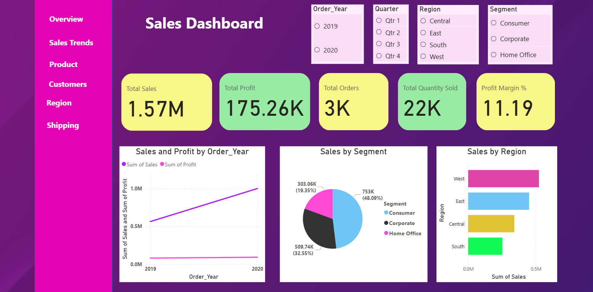

# 📊 Retail Sales Performance Dashboard (Power BI)

📌 Project Overview

This project presents an interactive Power BI dashboard built using the **SuperStore Sales Dataset** to analyze retail business performance.
The dashboard provides insights into sales trends, profitability, customer behavior, product performance, regional distribution, and shipping analysis to support data-driven decision-making.



### 🌐 Live Dashboard (Published)

🔗 Power BI Published Report:
👉 Add your Power BI Service link here

```bash
https://app.powerbi.com/groups/me/reports/72bd7d79-f980-4d0d-8d42-2040e2fe065c/d54c057ddb56fbe24017?experience=power-bi
```

## Power BI Dashboard Pages

For a better viewing experience with detailed pages, please visit [Pages](pages.md)

### 🎯 Objectives

- Analyze sales and profit performance over time
- Identify top and low-performing products and categories
- Understand customer segments and regional trends
- Evaluate shipping modes and operational efficiency
- Provide an executive-level overview for business stakeholders

###  🗂️ Dashboard Pages

- Overview – High-level KPIs and summary insights
- Sales Trends – Year & month-wise sales and profit trends
- Products – Category and sub-category performance analysis
- Customers – Customer segments and top customer insights
- Regions – Regional and city-level performance
- Shipping – Shipping mode and delivery performance analysis

### 📈 Key KPIs

- Total Sales
- Total Profit
- Total Orders
- Total Quantity Sold
- Profit Margin (%)

All KPIs are dynamically updated using DAX measures and interactive slicers.

### 🛠️ Tools & Technologies

- Power BI Desktop
- DAX (Data Analysis Expressions)
- Microsoft Excel (Dataset Source)
