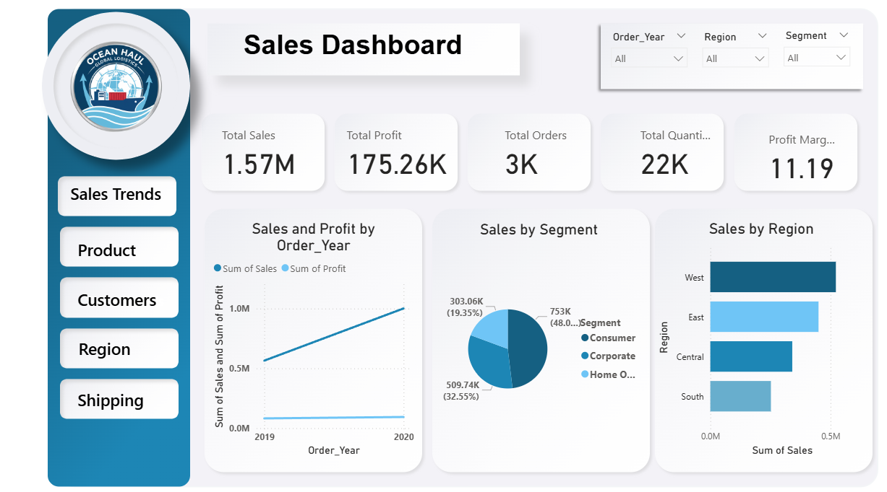
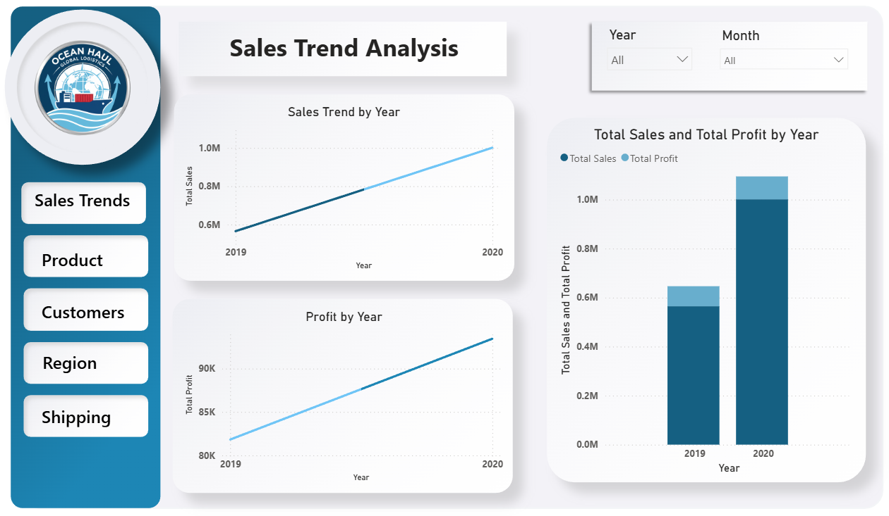
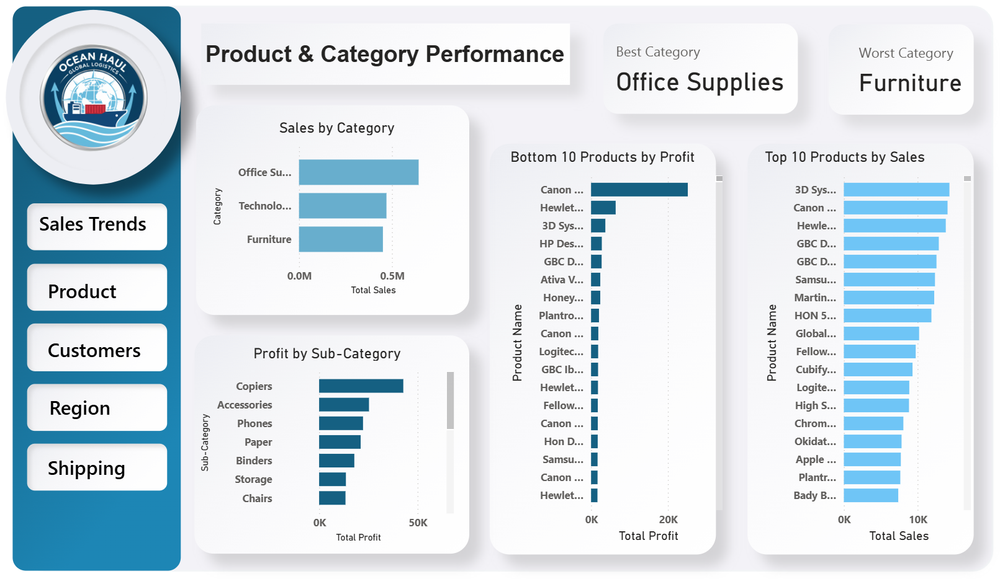
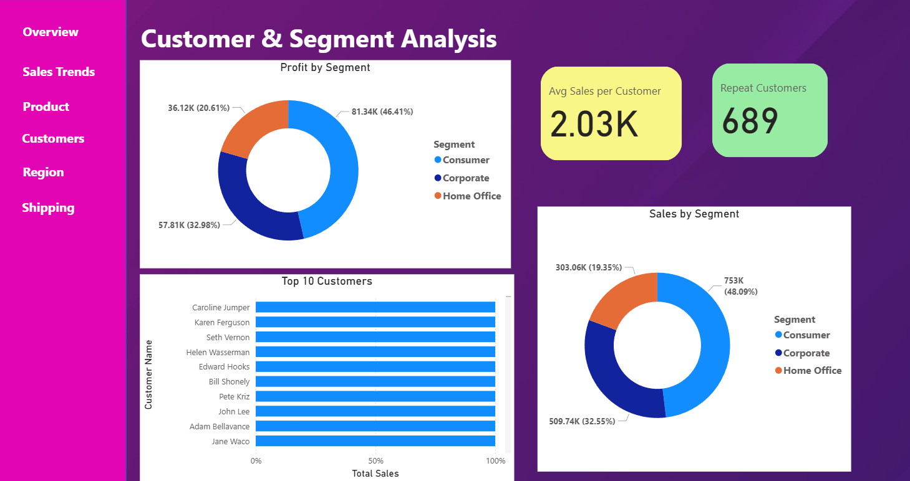
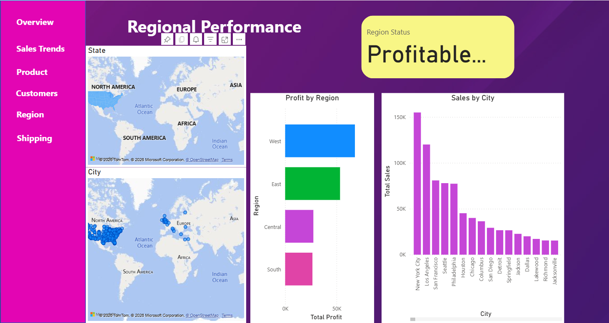
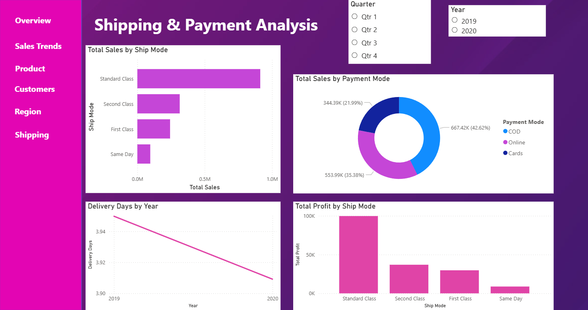

# Power BI Dashboard Images

[← Back to README](README.md)

---
 ## Executive Sales Performance Dashboard

Shows overall sales, profit, orders, and top trends for quick manager view.

 
 
 ---
 ## Sales Trend Analysis

Shows sales and profit changes over time to spot growth or decline.

 
 
 ---

  ## Product & Category Performance 
  
  Shows best and worst products and categories by sales and profit.

 
 
 ---

  ## Customer & Segment Analysis 
  
  Shows which customers and segments bring the most sales and profit.

 
 
 ---

  ## Regional Performance 
  
  Shows which regions or cities are performing best or worst.

 
 
 ---

 ## Shipping & Payment Analysis  
 
 Shows sales by shipping and payment methods, plus delivery efficiency.

 
 
 ---

[← Back to README](README.md)
